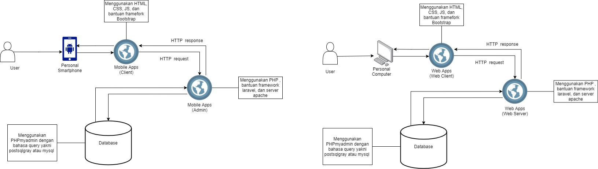

# Pikmi

## Anggota Kelompok :
- Faisal Ibrahim Abusalam (G64190054)
  - Backend
- Muhammad Ezra Fathurrahman (G64190030)
  - Frontend
- Rizal Mujahiddan (G64190069)
  - Backend
- Wildan Fajri Alfarabi (G64190060)
  - UI/UX

## About Pikmi!
Pikmi! adalah aplikasi berbasis web sebagai wadah yang ditujukan 
untuk Mahasiswa IPB yang ingin berkarya dengan mengikuti 
Pekan Kreativitas Mahasiswa atau lebih sering dikenal dengan sebutan PKM.

Pikmi! membantu para Mahasiswa dalam mencari anggota kelompok dan mencari 
kelompok PKM yang mereka ingin ikuti. User juga dapat membuat profile yang
dilengkapi dengan informasi terkait portofolio user, keahlian user, dan juga 
seberapa besar komitmen yang mereka bisa berikan kepada kelompok PKM nya.
Profile page tersebut berfungsi agar dapat mempermudah perekrutan kedalam
tim PKM.

Pikmi! juga menyediakan kontak yang dapat dihubungi oleh User apabila ada 
pertanyaan yang ingin ditanyakan kepada Tim PKM yang telah dibuat oleh User lain.
Pikmi! membantu User menemukan tim PKM impian mereka dengan cara menampilkan
list dari ide-ide tim PKM. Pada laman ini, User dapat melihat sekilas deskripsi
mengenai ide PKM, tema PKM, dan juga illustrasi dari tim PKM tersebut. 

## Spesifikasi Lingkungan Pengambangan Aplikasi Pikmi!
### Software 
- Server :
  - Apache

- Database :
  - MySQL

- Frontend :
  - HTML
  - CSS
  - JS
  - ....

- Backend :
  - PHP
  - ....

- UI/UX Design :
  - Figma
  - Adobe Illustrator
  - Adobe Photoshop

### Hardware 
- Laptop Asus xx :
  - Intel xx
  - Ram xx
  - GPU xx
  - ...
- Laptop Lenovo xx :
  - AMD xx
  - Ram xx
  - GPU xx
  - ...
- Redmi Note x :
  - Qualcom xx
  - RAM xx
  - storage xx

### Tech Stack 
***ga ngerti gaes ini apa maksudnya***

## Pembahasan dan Hasil
### Use Case Diagram

### Activity Diagram

### Class Diagram

### Entity Relationship Diagram (ERD)

### Arsitektur Sistem

### Fungsi Utama yang Dikembangkan

### Fungsi CRUD

## Hasil Implementasi

## Testing Test Case (TC)
### Positive Cases

### Negative Cases

## Saran Untuk Development Selanjutnya
***apayagaes sarannya***
