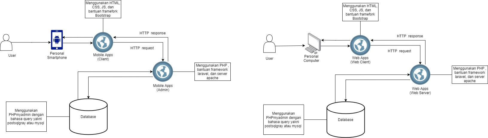

# Pikmi

## Anggota Kelompok :
- Faisal Ibrahim Abusalam (G64190054)
  - Backend
- Muhammad Ezra Fathurrahman (G64190030)
  - Frontend
- Rizal Mujahiddan (G64190069)
  - Backend
- Wildan Fajri Alfarabi (G64190060)
  - UI/UX

## About Pikmi!

Pikmi! adalah aplikasi berbasis web sebagai wadah yang ditujukan 
untuk Mahasiswa IPB yang ingin berkarya dengan mengikuti 
Pekan Kreativitas Mahasiswa atau lebih sering dikenal dengan sebutan PKM.

Pikmi! membantu para Mahasiswa dalam mencari anggota kelompok dan mencari 
kelompok PKM yang mereka ingin ikuti. User juga dapat membuat profile yang
dilengkapi dengan informasi terkait portofolio user, keahlian user, dan juga 
seberapa besar komitmen yang mereka bisa berikan kepada kelompok PKM nya.
Profile page tersebut berfungsi agar dapat mempermudah perekrutan kedalam
tim PKM.

Pikmi! juga menyediakan kontak yang dapat dihubungi oleh User apabila ada 
pertanyaan yang ingin ditanyakan kepada Tim PKM yang telah dibuat oleh User lain.
Pikmi! membantu User menemukan tim PKM impian mereka dengan cara menampilkan
list dari ide-ide tim PKM. Pada laman ini, User dapat melihat sekilas deskripsi
mengenai ide PKM, tema PKM, dan juga illustrasi dari tim PKM tersebut. 

## Spesifikasi Lingkungan Pengambangan Aplikasi Pikmi!

### Software 
- Operating System (OS) :
  - Windows 10

- Text Editor :
  - Ms Visual Studio Code
  - Sublime Text

- Framework	: 
  - Laravel

- UI/UX Design :
  - Figma
  - Adobe Illustrator
  - Adobe Photoshop

### Hardware 
- Laptop Asus xx :
  - Intel xx
  - Ram xx
  - GPU xx
  - ...
- Laptop Lenovo xx :
  - AMD xx
  - Ram xx
  - GPU xx
  - ...
- Redmi Note x :
  - Qualcom xx
  - RAM xx
  - storage xx

### Tech Stack 
- Frontend :
  - HTML
  - CSS
  - JS
  - ....

- Backend :
  - PHP
  - ....

- Library	: 
  - Bootstrap

- Server :
  - Apache

- Database :
  - MySQL
 
## Pembahasan dan Hasil

### Use Case Diagram

### Activity Diagram

### Class Diagram

### Entity Relationship Diagram (ERD)

### Arsitektur Sistem

### Fungsi Utama yang Dikembangkan
- Fungsi List Idea :
List Idea ini berfungsi sebagai perantara antara Tim PKM dan Anggota yang ingin bergabung
kedalam Tim PKM tersebut. User dapat melihat ide-ide dari masing masing Tim PKM agar dapat
menemukan Tim PKM impian mereka. User dapat membuat ide baru apabila ingin membuat 
Tim PKM yang baru. Selain itu, user juga dapat mengupdate illustrasi ide pkm dan juga deskripsinya.

- Fungsi List Member :
List member dapat menjadi perantara bagi Tim PKM yang sedang mencari anggota yang tepat.
Karena pada page ini, User dapat melihat informasi dari user lain. Informasi yang dapat
dilihat seperti nama, nomor kontak, keahlian, portofolio, komitmen yang mereka dapat berikan,
dan lain-lainnya. Sebagai User, User juga dapat mengupdate informasi dari akunnya.

### Fungsi CRUD
- *Create* 
Fungsi Create pada aplikasi *web based* Pikmi! ini terdapat pada fitur membuat ide.
Ide dapat dibuat dengan cara menekan tombol buat ide, nantinya user akan memasukan informasi
deskripsi dan juga illustrasi dari ide PKMnya tersebut. Selain fitur membuat ide, 
fungsi create juga digunakan dalam proses pembuatan akun yang akan digunakan oleh user. 
Semua data yang telah dibuat nantinya akan disimpan di dalam database.

- *Read*
Data-data dari database akan di fetch oleh aplikasi Pikmi! untuk ditampilkan ke user pada
laman-laman Pikmi!. Seperti informasi terkait deskripsi dari ide-ide yang dibuat oleh
User-user, informasi terkain profile user, dan lain-lainnya.

- *Update*
User dapat memperbarui informasi yang terdapat di laman profile mereka. User dapat memperbarui 
informasi di laman profile mereka dengan menekan tombol Edit Profile. Selain itu, apabila
user telah membuat ide untuk Tim PKMnya, mereka juga dapat memperbarui informasi-informasi
dari ide PKMnya tersebut.

- *Delete*
Apabila User telah membuat ide untuk Tim PKM, mereka dapat membatalkan ide tersebut dengan
cara menghapusnya. Apabila User menekan tombol Hapus Ide PKM, maka database akan menghapus 
data Ide PKM yang telah user buat.

## Hasil Implementasi
***Screenshot Pikmi!-nya nnti taro disini gaes***

## Testing Test Case (TC)

### Positive Cases

### Negative Cases

## Saran Untuk Development Selanjutnya
***apayagaes sarannya***
